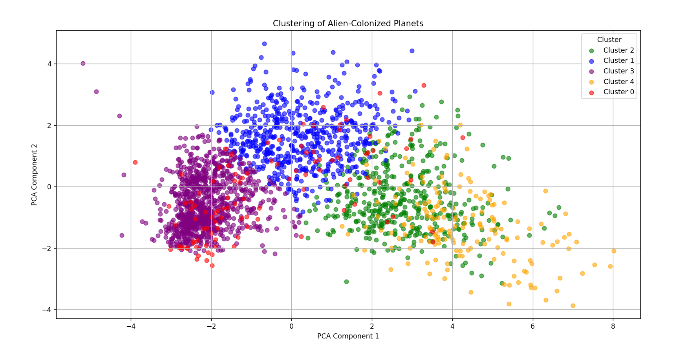

# Clustering of Alien-Colonized Planets

## Team Members

- Nikita Fyodorov 307141 1 (“captain”)
- Daniyar Dyussembayev 303501 2
- Eldar Kurbanov 306021 3 
---

## [Section 1] Introduction

This project focuses on analyzing and clustering planets colonized by aliens using unsupervised machine learning techniques. By applying KMeans clustering and Principal Component Analysis (PCA), we aim to uncover patterns and group similar planets together, providing insights into their characteristics.

---

## [Section 2] Methods

### Data Preprocessing

- **Handling Missing Values**:
  - **Dropping Columns**: Removed columns with more than 40% missing data to ensure data quality.
  - **Imputing Numerical Features**: Filled missing numerical values with the median of each column to minimize the effect of outliers.
  - **Imputing Categorical Features**: Filled missing categorical values with the mode of each column to preserve the most common category.

- **Feature Engineering**:
  - **Discovery Year**: Converted `Discovery_Date` column to datetime format and extracted the year into a new `Discovery_Year` feature.
  - **Dropping Columns**: Dropped the original `Discovery_Date` column after extracting the year.

### Feature Transformation

- **Numerical Features**: Applied  `StandardScaler` to normalize numerical data.
- **Categorical Features**: Used `OneHotEncoder` to convert categorical variables into a numerical format.

### Clustering

- **Algorithm**: KMeans clustering with 5 clusters `n_clusters=5` and set a random state `random_state=42` for reproducibility.
- **Pipeline**: Created a pipeline that combines preprocessing and clustering steps for efficient execution.

### Dimensionality Reduction

- **PCA**: Reduced the dataset to two principal components for visualization purposes.

### Environment Setup

- **Programming Language**: Python 3.x
- **Libraries Used**:
  - pandas
  - scikit-learn
  - matplotlib

### Design Choices

- **Why KMeans**: Selected for its simplicity and effectiveness in clustering unlabeled data.
- **Why PCA**: Employed PCA to reduce dimensionality, allowing visualization of high-dimensional data in two dimensions.
- **Data Imputation**: Opted for median and mode imputation to handle missing values without introducing significant bias.

---

## [Section 3] Experimental Design

### Main Purpose

The main goal is to identify distinct clusters among alien-colonized planets to understand underlying patterns and characteristics within the dataset.

### Baselines

- **No Baseline Model**: As an unsupervised learning task, there is no direct baseline model for comparison.
- **Cluster Number Selection**: Started with 5 clusters as an initial assumption for analysis.

### Evaluation Metrics

- **Inertia**: Measures the within-cluster sum of squares to assess cluster cohesion.
- **Silhouette Score**: Can be utilized in future iterations to evaluate cluster consistency.

---

## [Section 4] Results

### Main Findings

- Successfully clustered the planets into five distinct groups, revealing potential patterns in the data.
- The PCA visualization shows clear distribution and some separation between clusters.

### Visualization

*Figure 1: PCA plot displaying the clustering of alien-colonized planets.*

- **Note**: The figure is generated from the code in `main.ipynb` and saved in the `images` folder.

---

## [Section 5] Conclusions

### Takeaway Points

- **Effective Clustering**: The KMeans algorithm effectively grouped planets, indicating inherent structures in the data.
- **Data Visualization**: PCA facilitated the visualization of high-dimensional data, aiding in the interpretation of clustering results.

### Future Work

- **Optimize Cluster Number**: Experiment with different values of `n_clusters` and use metrics like the Silhouette Score to find the optimal number of clusters.
- **Feature Importance**: Investigate which features most significantly influence cluster formation to gain deeper insights.
- **Address Limitations**: Assess the impact of different imputation techniques on the clustering results.

---

